# Shonchoy: The Everyday Expense Tracker

  

  <h2 align="center">Stop guessing where your money went!</h2>

  <b>Fast • Offline • Frictionless</b> 
  The only finance app designed for the "3-Tap Rule": Log an expense in under 5 seconds.

 

  

  <small><i>v1.0.0 • No Account Required • Free Forever!</i></small>

  
  

---

## 🧐 Why Another Expense Tracker?

Most finance apps are **too slow**. They ask for too many details, require internet, or force you to create an account.

**Shonchoy is different.** It is built for **velocity**.

- **No Login:** Open the app and start immediately.
- **No Loading:** Everything is stored on your phone.
- **No ads:** Just you and your finances.

> _"If logging a coffee takes more than 5 seconds, you won't do it. Shonchoy fixes that."_

---

## ✨ Features You'll Actually Use

### 1. The "3-Tap" Entry System (Core)

- **Speed:** Log a transaction in < 5 seconds.
- **Custom Keypad:** Large, dedicated numeric pad (No system keyboard lag).
- **Smart Category Grid:** Automatically bubbles up your top 3 most-used categories to the top row.
- **Smart Defaults:** Auto-selects "Today" and "Now".

### 2. The Dashboard (Visuals)

- **Live Balance:** `(Income - Expense) = Current Balance`.
- **Budget Health Bar:** Color-coded progress bar (Green → Orange → Red) based on monthly spending.
- **Safe Spend Indicator:** Calculates exactly how much you can spend _per day_ for the rest of the month.
- **Spending Breakdown:** Simple Pie Chart and "Top Spenders" list.

### 3. Debt & Lending Tracker

- **IOU Management:** Separate tab for "I Owe" vs "Owes Me".
- **Net Worth Impact:** Shows a "Net Debt Position" card on the dashboard.
- **Partial Payments:** Track repayments without closing the entire debt.

### 4. Smart Tutorials (Contextual)

- **Onboarding:** "Cold Start" setup to set initial cash balance.
- **Walkthroughs:** Interactive "Coach Marks" guide users through the FAB, Budget Bar, and Swipe Actions.
- **Just-in-Time:** Teaches "Swipe to Delete" and "Swipe to add note" only after the _second_ transaction is created.

### 5. Data & Settings

- **PDF Export:** Generate professional, printable transaction reports.
- **Category Limits:** Set soft monthly limits for specific categories (e.g., Food: ৳5,000).
- **Offline First:** 100% local data ownership. No servers, no accounts.
- **Dark Mode:** System-wide support.

### 6. Budget Planner

- **New Module:** Added BudgetPlannerScreen accessible via Settings.
- **Architecture:** Implemented a separate Hive Box (budget_plan_box) to ensure planning data never interferes with actual transaction history.
- **Dynamic Dashboard:** Reused the core Dashboard UI components to visualize "Planned Income" vs. "Planned Expenses."
- **Custom Inputs:** Users can now assign budgets to specific custom names (Strings) rather than fixed Category Enums, allowing for granular planning (e.g., separating "Groceries" from "Snacks").

---

## 📱 Screenshots

<table align="center">
  <tr>
    <td align="center">
      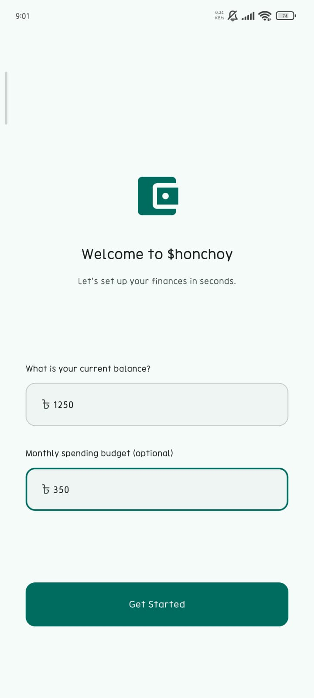
    </td>
    <td align="center">
      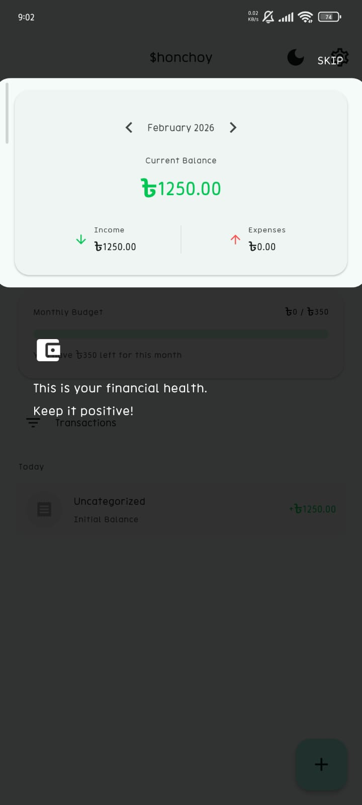
    </td>
    <td align="center">
      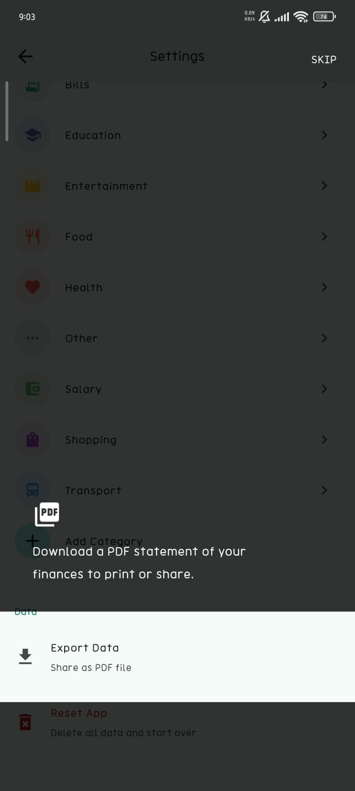
    </td>
  </tr>
  <tr>
    <td align="center">
      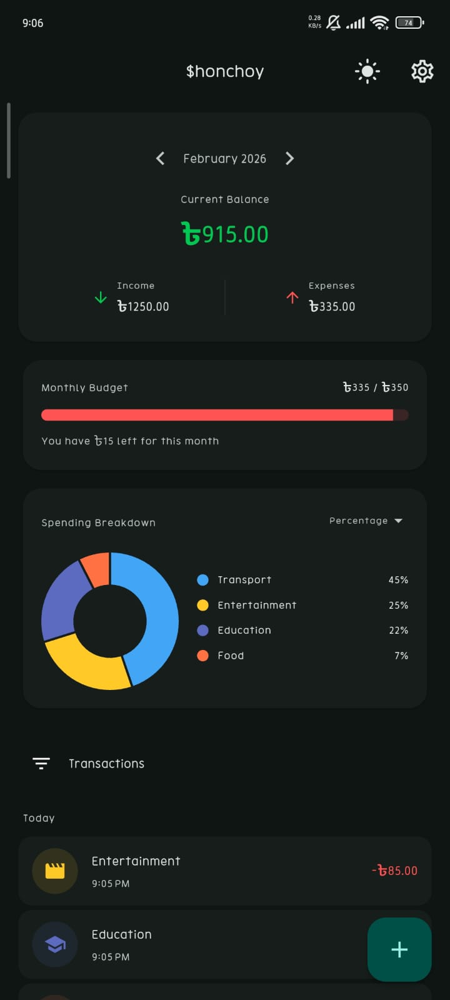
    </td>
    <td align="center">
      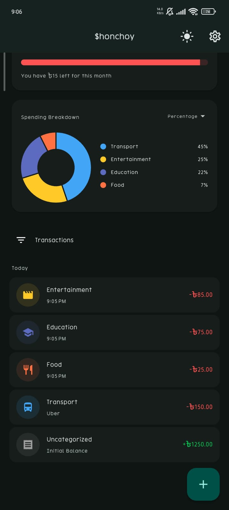
    </td>
    <td align="center">
      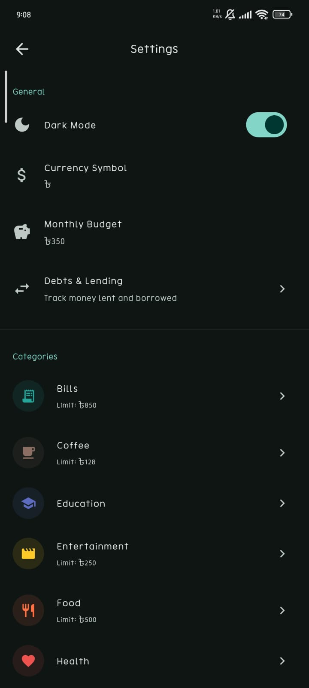
    </td>
  </tr>
  <tr>
    <td align="center">
      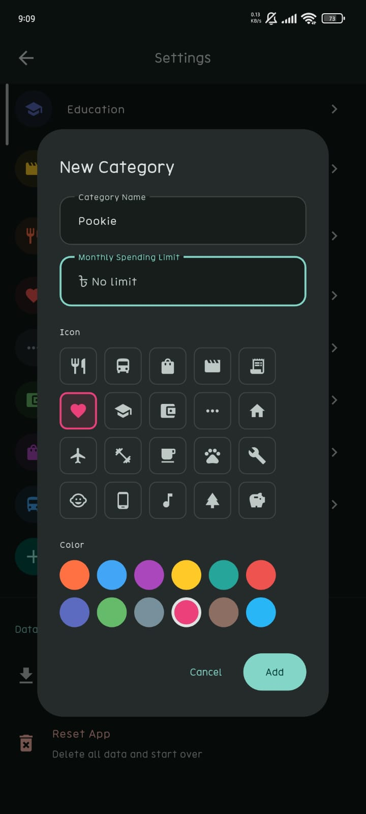
    </td>
    <td align="center">
      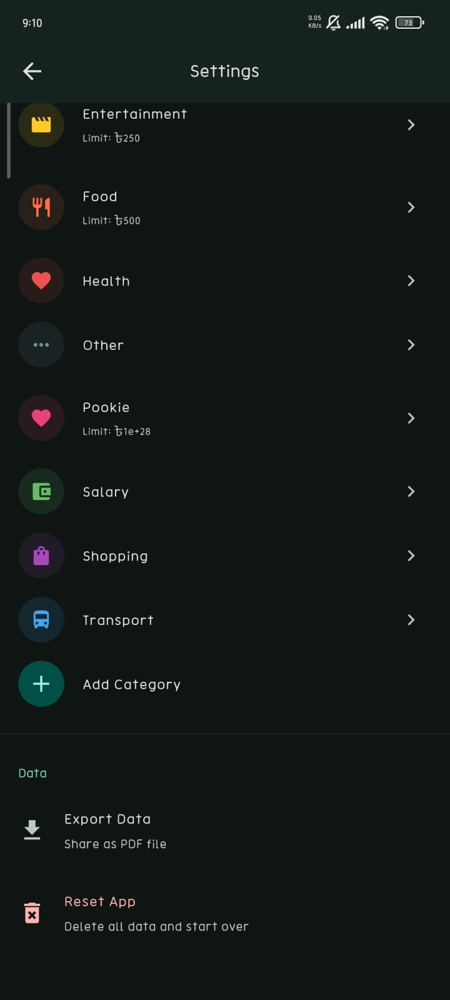
    </td>
    <td align="center">
      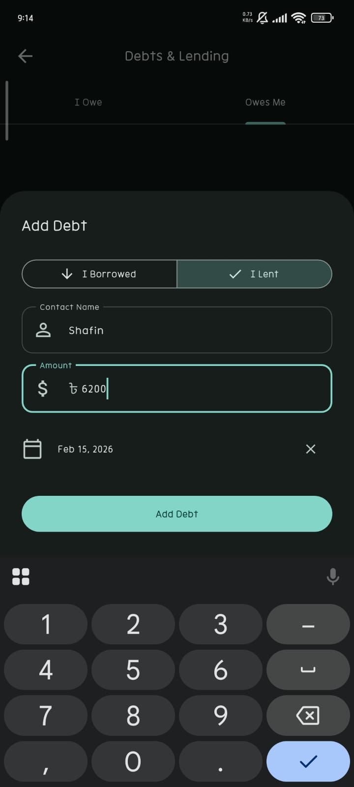
    </td>
  </tr>
  <tr>
    <td align="center">
      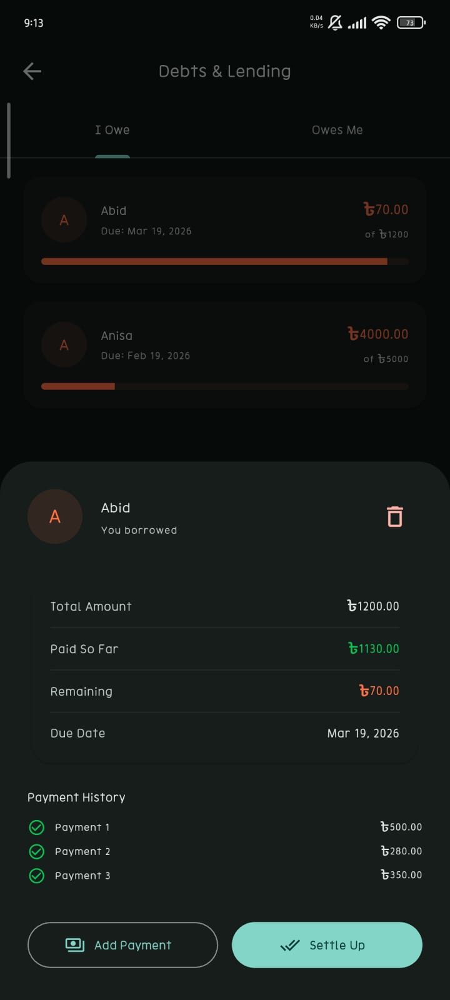
    </td>
    <td align="center">
      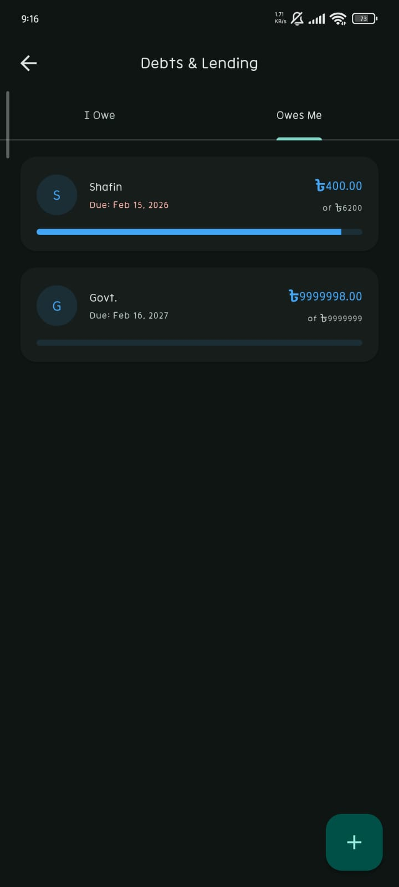
    </td>
    <td align="center">
      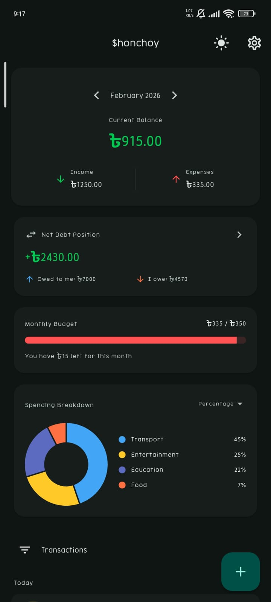
    </td>
  </tr>
</table>

---

## 📥 How to Install (Android)

Since Shonchoy is privacy-focused and open-source, you can install it directly via APK:

1.  **Download:** Click the green [**Download APK**] button at the top.
2.  **Open:** Tap the downloaded file (`Shonchoy_ExpenseTracker.apk`).
3.  **Install:** If prompted, allow "Install from Unknown Sources" (this is standard for apps outside the Play Store).
4.  **Enjoy:** Start tracking in seconds!

---

## 💬 Feedback & Support

Found a bug? Have a feature request?

- 🐛 [Report an Issue](https://github.com/Ahnaf181419/Expense-Tracker/issues)
- ⭐ **Star this repo** if you find it useful!

---

  Built with ❤️ using <b>Flutter</b>.

