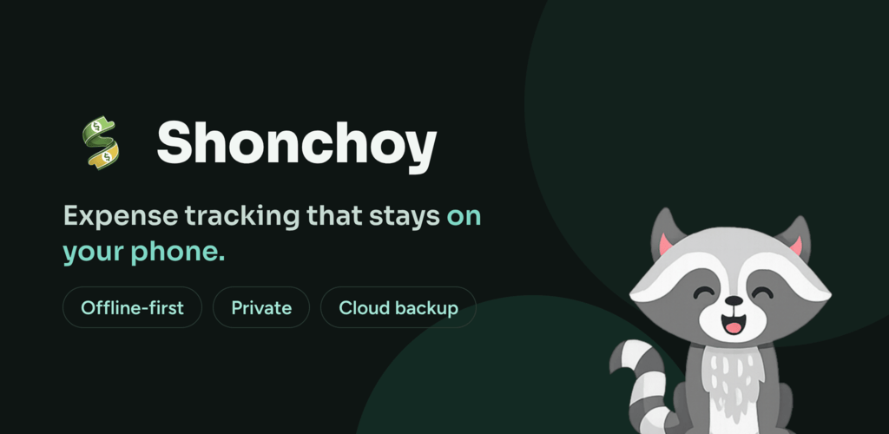
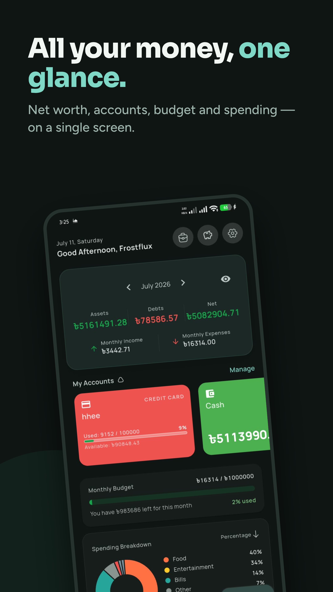
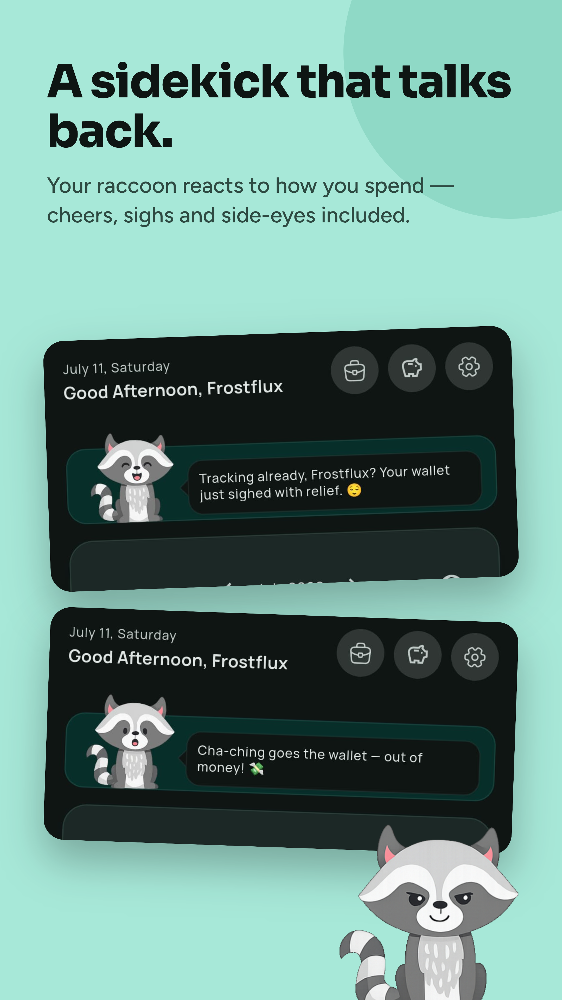
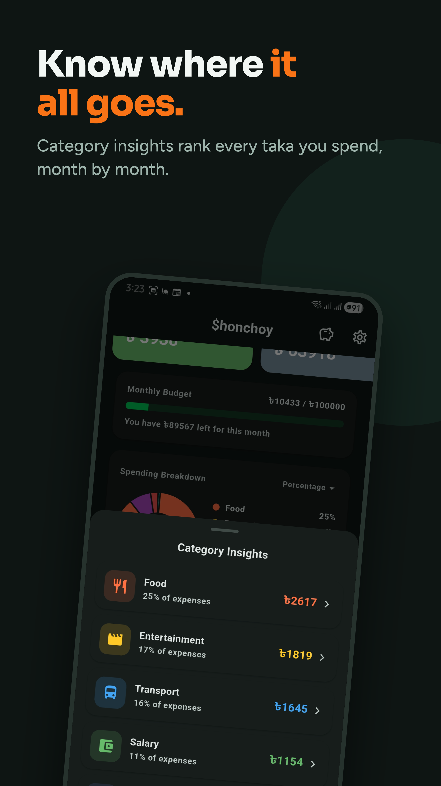
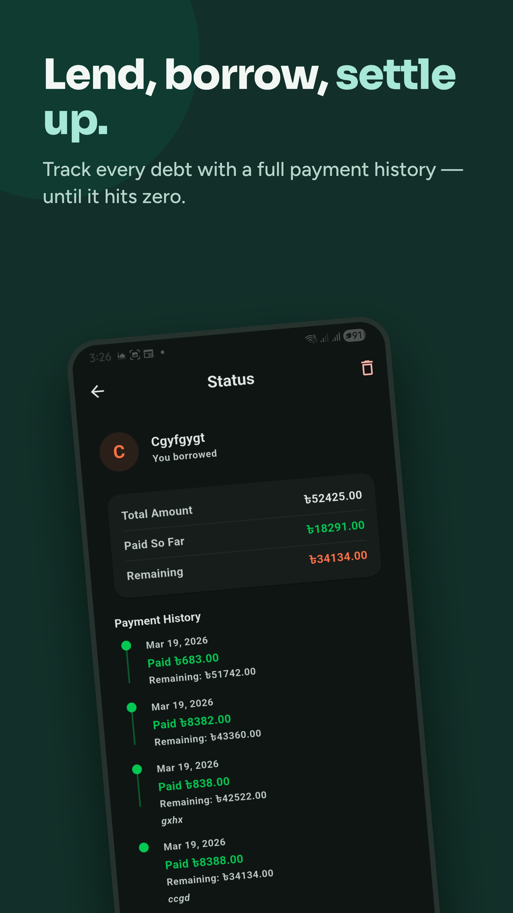
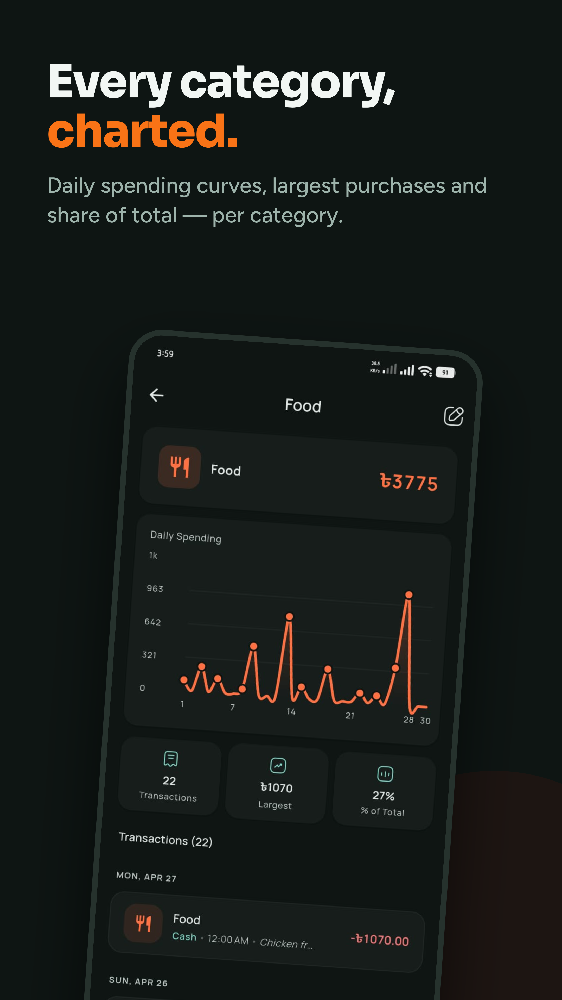
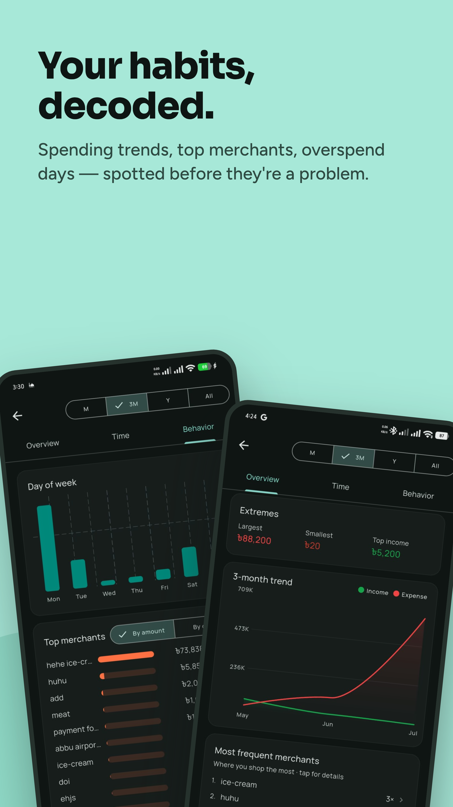
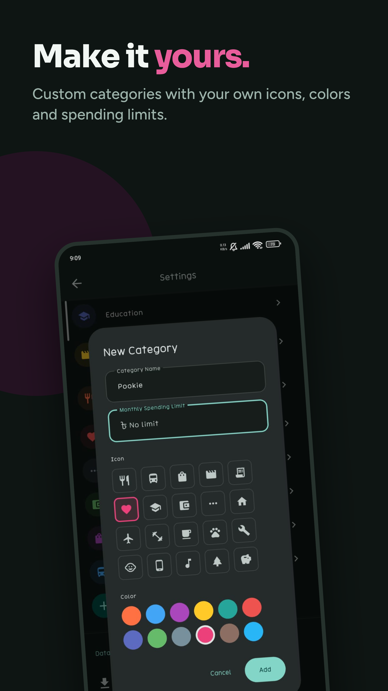
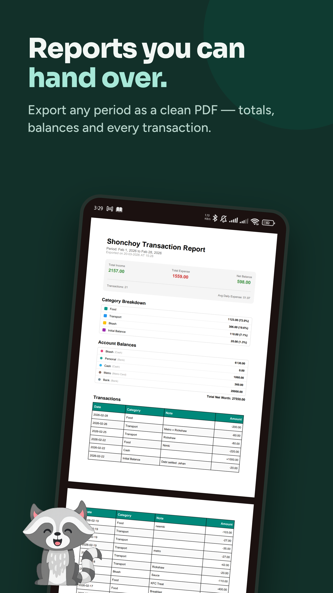
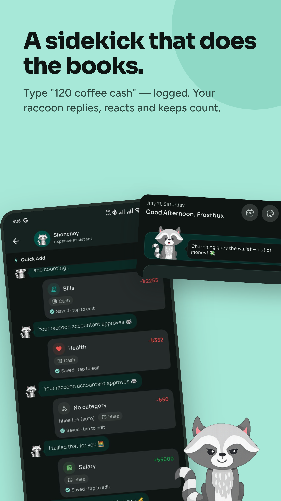

# Shonchoy — The Everyday Expense Tracker

  

  <b>Stop guessing where your money went!</b> 
  <i>Fast • Offline • Frictionless</i>

  A finance app built for the <b>"3-Tap Rule"</b> — log an expense in under 5 seconds.

  

  
  
  
  
  

  

---

## Why Another Expense Tracker?

Most finance apps are **too slow**. They demand details you don't have, force you to create an account, and stop working the moment you lose signal. Your information isn't really yours.

**Shonchoy is built for velocity.**

- **No login** — open the app and start immediately.
- **No loading** — everything lives on your phone.
- **No ads, no trackers** — just you and your money.

> _"If logging a coffee takes more than 5 seconds, you won't do it. Shonchoy fixes that."_

---

## What's New in v4.0.0

A major rebuild. Everything below is new or significantly reworked since v3:

- **Bill Splitter** — split a bill four ways, settle up with the fewest transactions.
- **Subscriptions** — track recurring payments; never miss a renewal.
- **App Lock + Biometric** — PIN + fingerprint/face protection.
- **4 Themes** — Fresh Teal, Midnight Ocean, Cozy Walnut, Iris Lavender.
- **Mascot Chat** — log an expense by just typing it.
- **Statistics** — trends, percentiles, top merchants.
- **Google Drive Backup** — encrypted backups to _your_ own Drive.
- **CSV Import/Export** + **Trash (undo)** + a built-in **expression calculator**.

---

## Features

### The 3-Tap Entry
Type an amount, tap a category, done. A custom keypad, an expression calculator (`100+50*2` → `200`), and a smart grid that floats your three most-used categories to the top row mean logging is muscle memory within a day.

### Dashboard
Live balance, net worth across accounts, a color-coded budget bar (green → amber → red), a daily **safe-to-spend** figure, and a donut breakdown of where your money went this month — all on one screen.

### Multi-Account Management
Cash, banks, cards, and mobile wallets. Account types are **currency-aware** — set BDT and you get bKash, Nagad, Rocket, Upay, DPS, and FDR out of the box. Credit cards get their own fields: limit, statement balance, minimum payment, and due day. Transfer between accounts (with an optional fee), and tap any account for its full history.

### Bill Splitter
Create a group (or a one-off Quick Split), record who paid how much, and split equally, by custom amounts, by percentage, or by shares. Shonchoy then computes the **minimum set of transactions** to settle everyone up.

### Subscriptions
Track every recurring payment with custom cycles (every N days/weeks/months/years), trial periods, and active/paused/cancelled states. See your monthly and yearly burn at a glance, with auto-recorded expenses on each renewal.

### Savings Goals
Set named targets, watch traffic-light progress bars fill, and deposit or withdraw with a full activity log. Goals carry over month to month.

### Budget Planner
Zero-based budgeting: assign every dollar a job. Set category-specific limits with daily/weekly/monthly/yearly intervals and optional rollover, then watch planned vs. actual side by side.

### Debts & Lending
Track money you owe and money owed to you. Record partial payments, see a full timeline, and get due-soon highlights. The dashboard shows your net debt position in one card.

### Category Insights
Tap any slice of the donut for a deep dive: a daily spending line chart, key stats (average, largest, % of total), and every transaction in that category.

### Statistics *(Pro)*
Go beyond the month: 12-month income/expense trends, median and 90th-percentile spending, your top merchants, and your five largest transactions in the range.

### Mascot Chat
Just type — _"spent 250 on groceries"_ — and Shonchoy parses the amount and category. Quick-add cards surface your recurring merchants. A raccoon mascot reacts to your spending with a bit of personality.

### App Lock & Security
An optional 4-digit PIN (stored as a salted hash in secure hardware storage) plus biometric unlock. Repeated wrong attempts trigger an escalating lockout.

### Themes
Four hand-tuned themes (Fresh Teal, Midnight Ocean, Cozy Walnut, Iris Lavender) plus a dark-mode toggle. **Fresh Teal is free**; the other three are part of Pro.

### Data & Backup
- **CSV import/export** — full backups that survive a phone reset.
- **PDF reports** — transaction history with category breakdown and account balances.
- **Google Drive backup** *(Pro)* — encrypted, to your own Drive. Nothing ever touches our servers.
- **Trash** — delete is undoable for 30 days.

---

## Free vs Pro

| | Free | Pro |
|---|:---:|:---:|
| Log expenses & income | **Unlimited** | **Unlimited** |
| Accounts | 5 | ∞ |
| Categories | 20 | ∞ |
| Savings goals | 1 | ∞ |
| Subscriptions | 1 | ∞ |
| Mascot chat | 3 / day | ∞ |
| PDF reports | 1 / month | ∞ |
| Themes | 1 (Fresh Teal) | All 4 |
| Statistics | — | ✓ |
| Google Drive backup | — | ✓ |

Upgrade anytime from **Settings → Upgrade to Pro** in the app.

---

## Screenshots

<table align="center">
  <tr>
    <td align="center"></td>
    <td align="center"></td>
    <td align="center"></td>
  </tr>
  <tr>
    <td align="center"></td>
    <td align="center"></td>
    <td align="center"></td>
  </tr>
  <tr>
    <td align="center"></td>
    <td align="center"></td>
    <td align="center"></td>
  </tr>
</table>

---

## Get It

Shonchoy is **[available on Google Play](https://play.google.com/store/apps/details?id=dev.frostflux.shonchoy)** — the recommended way to install (auto-updates, Pro upgrade, and full support).

1. Open the **[Google Play listing](https://play.google.com/store/apps/details?id=dev.frostflux.shonchoy)**.
2. Tap **Install**.
3. Set your starting balance — and you're tracking.

---

## Privacy

Shonchoy is offline-first. Your transactions, accounts, and budgets never leave your device unless **you** explicitly export or back them up. Read the full [Privacy Policy](privacy-policy.html).

---

## Feedback & Support

Found a bug? Have an idea?

- [Report an issue](https://github.com/Ahnaf181419/Shonchoy/issues)
- **Star** this repo if Shonchoy helps you.

---

## License

Proprietary. See [LICENSE](LICENSE) for details.

---

  Built with Flutter by <b>Ahnaf</b>. 
  <i>Stop guessing where your money went.</i>

