# Shonchoy: The Everyday Expense Tracker

  

  <h2 align="center">Stop guessing where your money went!</h2>

  <b>Fast • Offline • Frictionless</b> 
  The only finance app designed for the "3-Tap Rule": Log an expense in under 5 seconds.

 

  

  <small><i>v3.0.0 • No Account Required</i></small>

  
  

---

## Why Another Expense Tracker?

Most finance apps are **too slow**. They ask for too many details, require internet, or force you to create an account. Shonchoy ensures your information remains completely private.

**Shonchoy is different.** It is built for **velocity**.

- **No Login:** Open the app and start immediately.
- **No Loading:** Everything is stored on your phone.
- **No Ads:** Just you and your finances.

> _"If logging a coffee takes more than 5 seconds, you won't do it. Shonchoy fixes that."_

---

## Features

### 1. The "3-Tap" Entry System

- **Speed:** Log a transaction in < 5 seconds.
- **Custom Keypad:** Large, dedicated numeric pad (no system keyboard lag).
- **Smart Category Grid:** Automatically surfaces your top 3 most-used categories to the first row.
- **Smart Defaults:** Auto-selects today's date and your default account.

### 2. The Dashboard

- **Live Balance:** Income - Expenses = Current Balance.
- **Net Worth:** Total across all accounts at a glance.
- **Budget Health Bar:** Color-coded progress (Green → Amber → Red) based on monthly spending.
- **Safe Spend Indicator:** Calculates exactly how much you can spend per day for the rest of the month.
- **Spending Breakdown:** Donut pie chart with category breakdown.
- **Net Debt Position:** Shows how much you owe vs. how much is owed to you.

### 3. Category Insights

- **Detailed Analytics:** Tap any category from the pie chart for a deep dive.
- **Daily Spending Chart:** Line graph showing spending trends over the month.
- **Stats Grid:** Key metrics like total spent and daily average.
- **Filtered Transactions:** All transactions for that category, grouped by date.

### 4. Multi-Account Management

- **17 Account Types:** Cash, Bank, Debit Card, Credit Card, Metro Card, Bkash, Nagad, Savings, Investment, DPS, FDR, Rocket, Upay, PayPal, Gift Card, Virtual Card, and Other.
- **Account Transfers:** Move money between accounts seamlessly.
- **Per-Account History:** View transactions filtered by account.

### 5. Debt & Lending Tracker

- **IOU Management:** Separate tracking for "I Owe" vs. "Owes Me".
- **Partial Payments:** Record repayments with a full payment timeline.
- **Dashboard Integration:** Net Debt Position card on the home screen.

### 6. Savings Goals

- **Goal Tracking:** Set targets with optional deadlines.
- **Progress Visualization:** Progress bars with current vs. target amounts.
- **Incremental Savings:** Add to goals over time with notes.
- **Monthly Rollover:** Savings carry forward automatically.

### 7. Budget Planner

- **Category-Specific Limits:** Assign monthly budgets to individual categories.
- **Planned vs. Actual:** Visualize planned income and expenses against reality.
- **Custom Names:** Assign budgets to custom labels for granular planning (e.g., separating "Groceries" from "Snacks").

### 8. Smart Tutorials

- **Onboarding:** Quick setup to set your initial balance and optional monthly budget.
- **Coach Marks:** Interactive spotlight walkthrough of the FAB, Budget Bar, Balance Card, and Settings.

### 9. Data & Settings

- **PDF Export:** Generate transaction reports with category breakdown and account balances. Date ranges: All Time, This Month, Last Month, Last 3 Months, or Custom.
- **9 Default Categories:** Food, Transport, Shopping, Entertainment, Bills, Health, Education, Salary, Other — plus unlimited custom categories.
- **Category Spending Limits:** Set soft monthly limits per category with visual warnings.
- **Dark Mode:** Manual toggle between light and dark themes.
- **Currency Symbol:** Configurable (default: ৳).
- **Check for Updates:** In-app update checker.
- **Offline First:** 100% local data. No servers, no accounts, no data leaves your phone.

---

## Screenshots

<table align="center">
  <tr>
    <td align="center">
      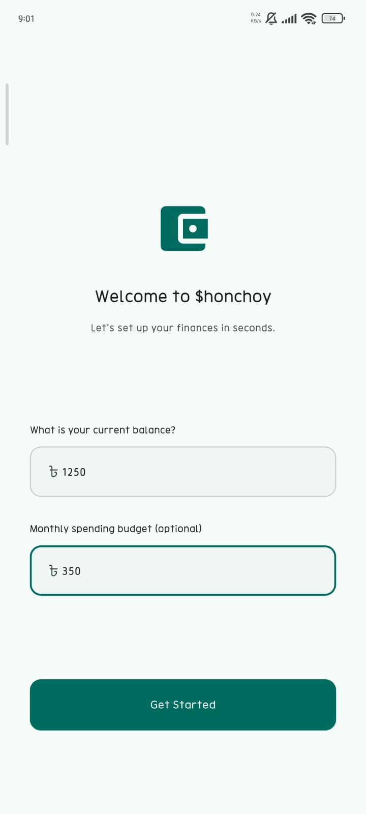
    </td>
    <td align="center">
      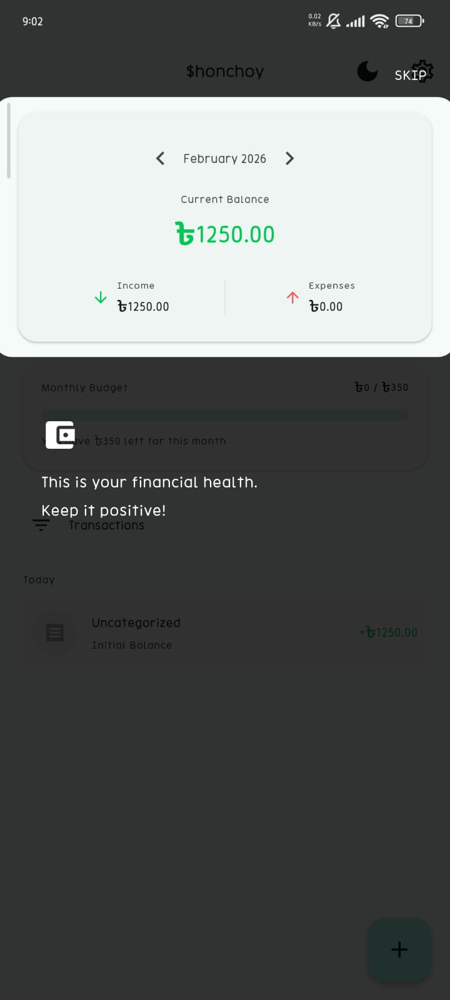
    </td>
    <td align="center">
      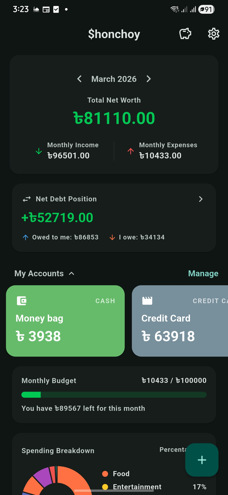
    </td>
  </tr>
  <tr>
    <td align="center">
      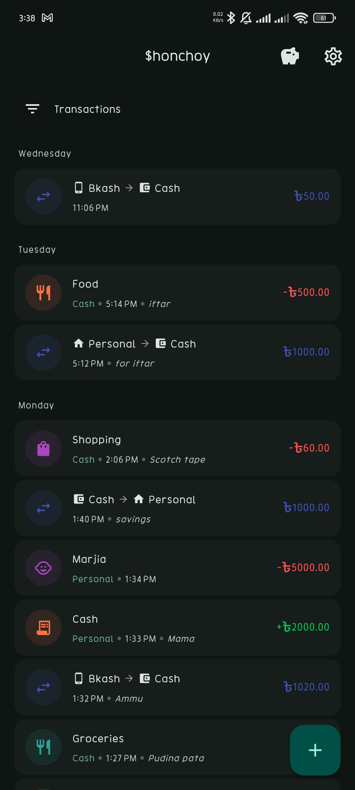
    </td>
    <td align="center">
      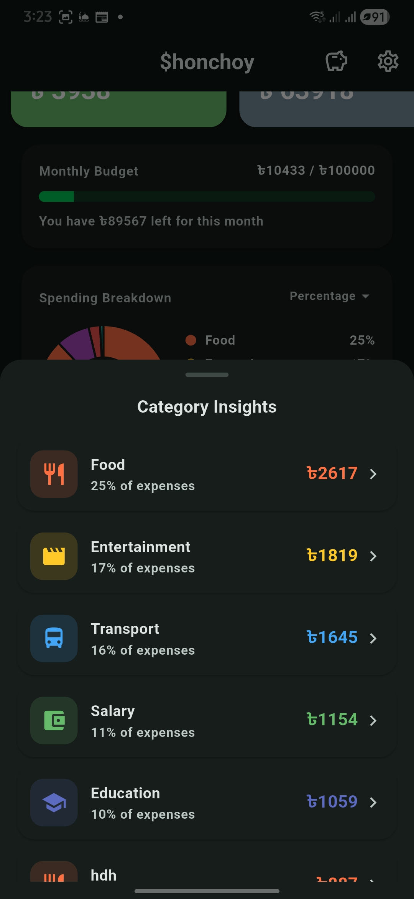
    </td>
    <td align="center">
      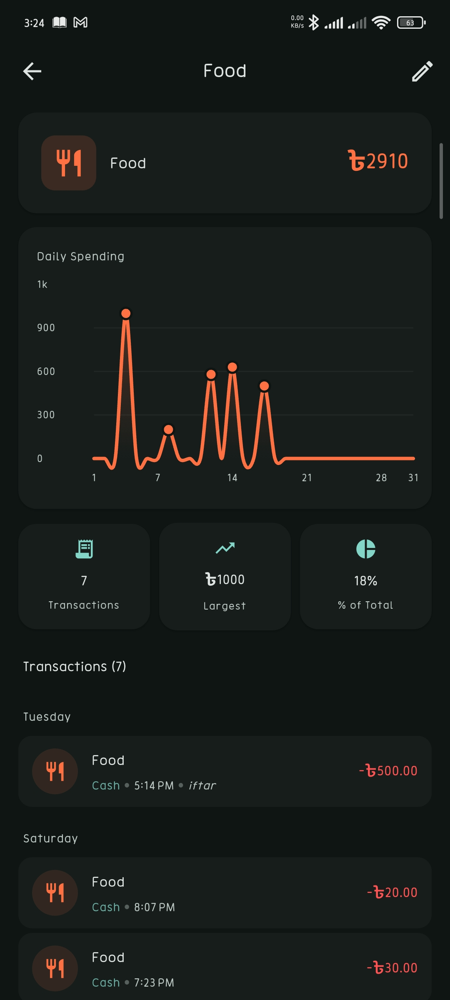
    </td>
  </tr>
  <tr>
    <td align="center">
      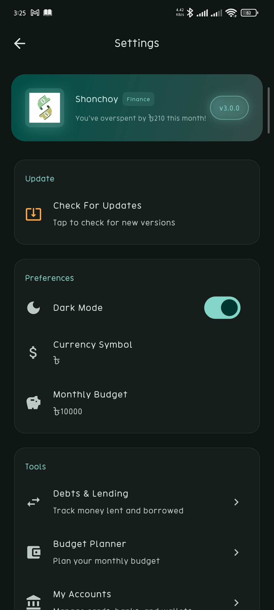
    </td>
    <td align="center">
      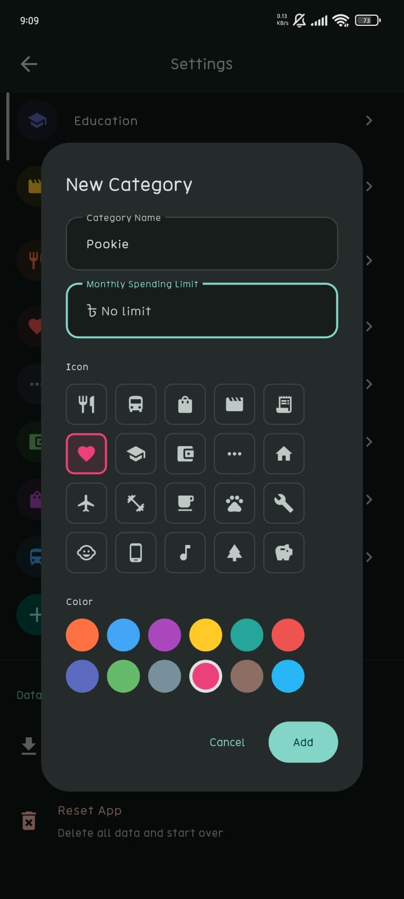
    </td>
    <td align="center">
      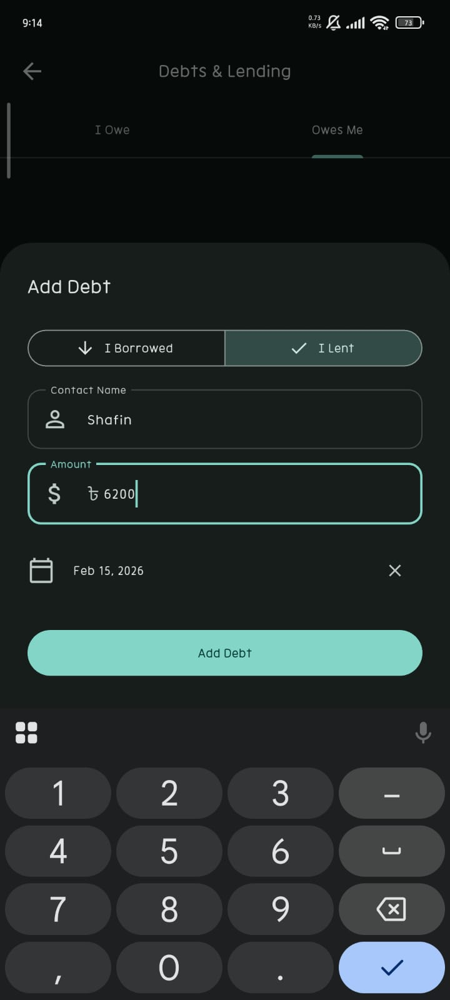
    </td>
  </tr>
  <tr>
    <td align="center">
      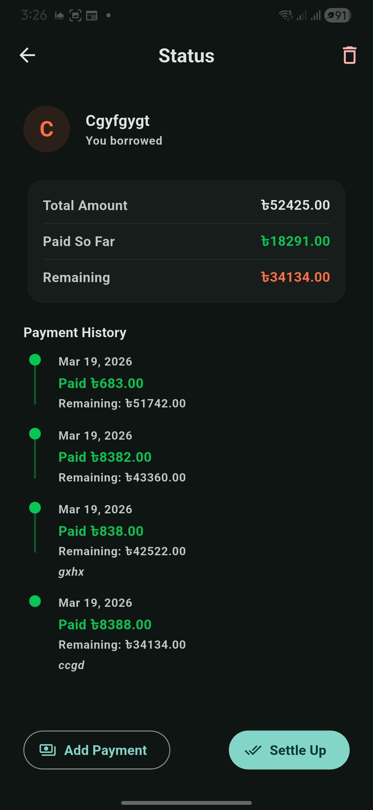
    </td>
    <td align="center">
      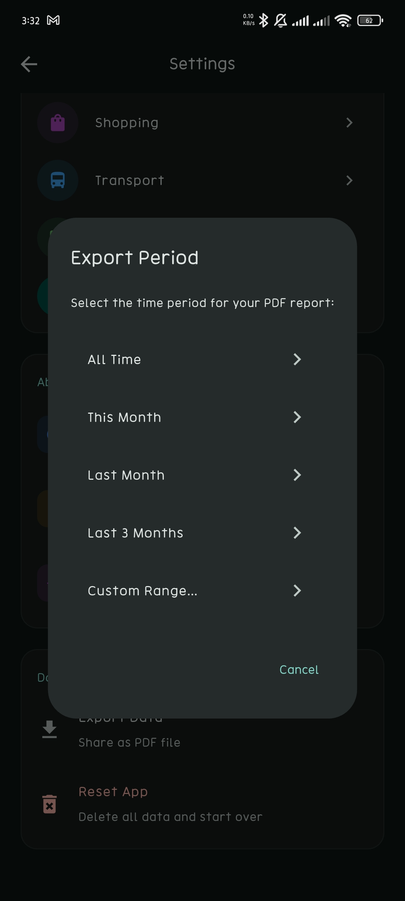
    </td>
    <td align="center">
      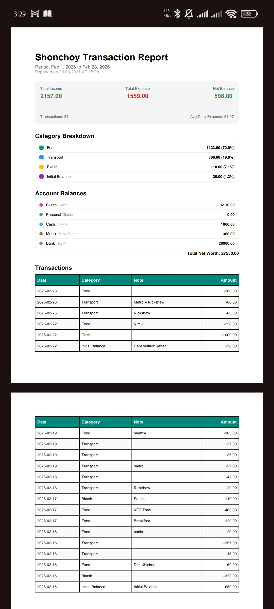
    </td>
  </tr>
</table>

---

## How to Install (Android)

1.  **Download:** Click the green [**Download APK**] button at the top.
2.  **Open:** Tap the downloaded file (`Shonchoy_ExpenseTracker.apk`).
3.  **Install:** If prompted, allow "Install from Unknown Sources" (this is standard for apps outside the Play Store).
4.  **Enjoy:** Start tracking in seconds!

---

## Feedback & Support

Found a bug? Have a feature request?

- [Report an Issue](https://github.com/Ahnaf181419/Expense-Tracker/issues)
- **Star this repo** if you find it useful!

---

## License

This software is proprietary. See [LICENSE](LICENSE) for details.

---

  Built with Flutter by <b>Ahnaf</b>.

